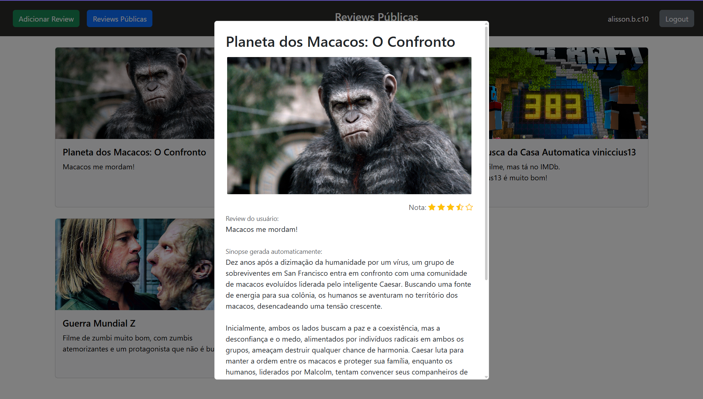

# Projeto 4: 

Imagens do **site criado**:  

Acesso: https://elc1090.github.io/project4-2025a-alisson/html/

#### Desenvolvedor
Álisson Braga Canabarro, Ciência da Computação

##### Descrição
É uma continuação do [Projeto 3](https://github.com/elc1090/project3-2025a-alissonbc), que é um site de compartilhamento de reviews de filmes. Nessa nova versão foi adicionado a opção para poder fazer login usando uma conta do Google e foi adicionado um campo para sinopse gerada pelo Gemini, sobre o filme que foi feita a review.  
Foram feitas outras pequenas mudanças visuais, como a adição de icone de estrelas para indicar que nota o usuário deu para o filme na hora de fazer a review.  

#### Desenvolvimento
Para esse projeto tive menos tempo livre para focar no desenvolvimento, então decidi focar apenas nos requisitos dele:  
- Implemente um cadastro de usuários com login federado usando um provedor de identidade;
- Utilize uma API externa de "IA como serviço"

Para o login federado, resolvi utilizar o Google. Como nesse projeto eu utilizo o Firebase Authentication, adicionar a nova opção foi simples: no Firebase selecionei o Google como método de login. No meu código adicionei a função `signInWithPopup()` que o próprio Firebase disponibiliza. Com isso apenas adicionei um botão que chama a função `signInWithPopup()`, indicando qual provedor vai ser utilizado (Google nesse caso).  

Para a API de IA, decidi que no contexto desse projeto ela poderia ser utilizada para adicionar uma breve sinopse do filme avaliado. Utilizei a API do Gemini, com um prompt básico:  
`Gere uma sinopse do filme \"${tituloFilme}\"`  
Inicialmente eu chamava a API com minha chave no front-end, mas após receber um aviso do GitHub sobre a chave exposta, resolvi mover para um back-end. Comecei pelo Replit, mas ao notar que a URL que ele gerava era temporaria, mudei para o Render.  

#### Tecnologias

- HTML
- CSS
- JS
- Bootstrap
- Firebase
- Render

#### Ambiente de desenvolvimento

VS Code com as extensões:
- HTML CSS Support

#### Referências e créditos

**Chat GPT, exemplo resumido de prompt:**
>Meu back-end no Replit gerou uma url assim: `https://32f8229d-gsi6-4924-42c8-919416c289b3-00-85lk6nxanqfr.janeway.replit.dev/`, com uma mensagem "_Dev URLs are temporary and will sleep after you leave the workspace._".  
Ela é temporaria mesmo ? será que dura por pelo menos um mês ? Senão que alterantivas tenho ?  
**Resposta do gpt:**  
>Para algo que dure pelo menos 1 mês sem cair toda hora nem mudar de URL, o Replit gratuito não serve.
Se você quer algo mais estável, tem 3 opções:
>
> - Usar esse Dev URL temporário enquanto estiver com o Replit aberto.
>
> - Pagar o plano Hacker ($7/mês) para ativar URLs fixas (chamadas "Replit Deployments").
>
> - Migrar o código para outro serviço gratuito com URL fixa (como Render, Vercel, ou Railway — posso ajudar nisso se quiser).

**Outro exemplo:**
> Estou recebendo o erro `html/:1 Access to fetch at 'https://backendt4web.onrender.com/' from origin 'https://elc1090.github.io' has been blocked by CORS policy: Response to preflight request doesn't pass access control check: No 'Access-Control-Allow-Origin' header is present on the requested resource.` ao tentar fazer requisições pro meu backend.  
**Resposta do gpt:**  
> Você precisa alterar o código do seu backend (no Render) para permitir requisições do seu front-end. Se estiver usando Express, adicione o seguinte: [...]

---
Projeto entregue para a disciplina de [Desenvolvimento de Software para a Web](http://github.com/andreainfufsm/elc1090-2025a) em 2025a
